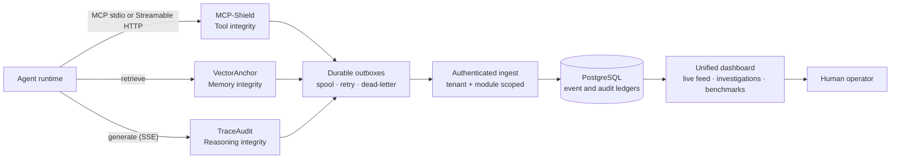

<div align="center">

<h1>PROJECT BLACK MONOLITH</h1>

<p><strong>Defense-in-depth security middleware for autonomous AI agents.</strong></p>
<p>Protect what agents call, remember, and reason about.</p>

[](https://github.com/yuno7777/project-black-monolith/actions/workflows/ci.yml)
[](LICENSE)
[](mcp-shield/)
[](vector-anchor/)
[](dashboard/)
[](supabase/)
[](https://github.com/yuno7777/project-black-monolith/actions/workflows/codeql.yml)
[](EVALUATION.md)

<br />

[Why it exists](#why-it-exists) ·
[Architecture](#architecture) ·
[Capabilities](#capabilities) ·
[Quick start](#quick-start) ·
[Demo](#end-to-end-demo) ·
[Evaluation](#measured-evaluation) ·
[Security](#security-model) ·
[Development](#development)

</div>

---

## Why it exists

An autonomous agent does not have a single attack surface.

Its **tools** can change after approval. Its **retrieval memory** can be seeded
with documents engineered to rank across unrelated queries. Its **reasoning
stream** can drift off-distribution or expose secrets before the final answer is
produced. Hardening only one layer leaves the others available to an attacker.

Project Black Monolith places an independent control at each layer and joins
their findings into one authenticated, tenant-aware evidence trail:

<div align="center">

**intercept → analyze → block / quarantine / redact → persist → investigate**

</div>

<table>
  <tr>
    <td width="25%" valign="top">
      <strong>01 / Tool layer</strong><br /><br />
      MCP-Shield fingerprints tool schemas, detects rug pulls and hidden
      instructions, and can restore the trusted schema before the agent sees
      the mutation.
    </td>
    <td width="25%" valign="top">
      <strong>02 / Memory layer</strong><br /><br />
      VectorAnchor detects documents that rank across mutually dissimilar
      topics, quarantines them, and serves the next-best clean result.
    </td>
    <td width="25%" valign="top">
      <strong>03 / Reasoning layer</strong><br /><br />
      TraceAudit monitors streaming divergence, terminates unsafe traces, and
      redacts credential or PII patterns before forwarding them.
    </td>
    <td width="25%" valign="top">
      <strong>04 / Control plane</strong><br /><br />
      The dashboard persists events, correlates sessions across layers, tracks
      incident decisions, and stores reproducible detector scorecards.
    </td>
  </tr>
</table>

> [!NOTE]
> This is defensive research tooling. Every attack artifact in this repository
> is a local, synthetic detection fixture. It does not target live systems,
> third parties, or real vulnerabilities, and the repository contains no real
> credentials. See [SECURITY.md](SECURITY.md).

---

## Architecture



The three modules make their enforcement decisions independently. Their event
delivery follows one shared contract:

- the source assigns a UUID `event_id`;
- the event is written to a durable local outbox before delivery;
- a tenant/module bearer token authenticates `POST /api/ingest`;
- Postgres persists the event before it is published over SSE;
- redelivery is deduplicated by `event_id`;
- operators investigate the immutable evidence without mutating it.

<details>
<summary><strong>Shared event envelope</strong></summary>

```json
{
  "event_id": "33d47f4a-5718-4bd9-8206-d1fbff615362",
  "schema_version": 2,
  "timestamp_ms": 1785164209264,
  "module": "mcp-shield",
  "event_type": "schema_mismatch",
  "severity": "critical",
  "tenant_id": "default",
  "agent_id": "agent-7",
  "session_id": "session-42",
  "trace_id": "trace-9",
  "correlation_id": "workflow-3",
  "details": {
    "tool": "read_file",
    "action": "rewritten"
  }
}
```

`tenant_id + agent_id + session_id` is the cross-layer correlation boundary.
`trace_id` identifies an operation inside that session, while
`correlation_id` can group a broader workflow.

</details>

---

## Capabilities

| Surface | Attack class | Detection | Enforcement |
| :--- | :--- | :--- | :--- |
| **MCP-Shield** | Tool-schema rug pull and poisoned descriptions | HMAC-SHA256 fingerprinting plus instruction, shell, and invisible-Unicode checks | Monitor or replace a mutated schema with its trusted baseline |
| **VectorAnchor** | Corpus poisoning and universal-bait documents | Cross-query frequency anomaly over mutually dissimilar topics | Quarantine the document and return a clean alternative |
| **TraceAudit** | Reasoning divergence and trace-level secret leakage | Rolling KL divergence plus credential/PII pattern scanning | Terminate the stream or redact sensitive spans |
| **Dashboard** | Lost evidence, forged attribution, cross-tenant access, unaccountable triage | Authenticated ingest, immutable ledgers, role checks, tenant predicates and RLS | Reject, deduplicate, isolate, audit, and correlate |

### The control plane is more than a feed

- **Live threat feed** — persisted history followed by real-time SSE updates.
- **Investigation queue** — assign, acknowledge, resolve, reopen, filter, and
  inspect the append-only audit trail.
- **Cross-layer correlation** — groups only the complete
  `(tenant_id, agent_id, session_id)` identity.
- **Benchmark ledger** — keeps detector scorecards separate from security
  events and recomputes metrics from the confusion matrix server-side.
- **Operations command center** — shows ledger latency, layer reachability,
  delivery backlog/dead-letter counts, policy coverage, and evidence age.
- **Evidence export** — downloads an immutable event, its incident state,
  append-only audit trail, and correlated session as one versioned JSON bundle.
- **Operator sessions** — exchanges a bootstrap token for a revocable,
  expiring, `HttpOnly`, `SameSite=Strict` browser session.
- **Production identity adapter** — validates asymmetric OIDC/Supabase JWTs,
  explicit role and tenant claims, issuer/audience, and optional AAL2 MFA.
- **Least-privilege database runtime** — the application uses a `NOLOGIN`,
  `NOSUPERUSER`, `NOBYPASSRLS` role with no table-level `DELETE` grants.

See the [dashboard guide](dashboard/README.md) and
[identity and access model](docs/IDENTITY_AND_ACCESS.md) for the full
authorization and database boundaries.

---

## Quick start

### Requirements

- Docker with Compose
- Bash
- `curl`

ChromaDB runs inside VectorAnchor and TraceAudit defaults to an offline mock
backend. The full demo does not require Ollama or an external vector database.

```bash
git clone https://github.com/yuno7777/project-black-monolith.git
cd project-black-monolith

# Generates six random local secrets in a gitignored .env file.
bash scripts/generate_secrets.sh

# Builds all five services and waits for real health checks.
docker compose up -d --build --wait

# Drives all three attack fixtures and verifies their shared session.
bash run_full_demo.sh
```

Open [http://localhost:3000](http://localhost:3000) and sign in with
`MONOLITH_OPERATOR_TOKEN` from your local `.env`.

The stack deliberately has no default credentials. Compose refuses to start
when the database password, module tokens, operator token, or service
administration token is absent. See [`.env.example`](.env.example) for the
complete configuration contract.

| Service | Port | Primary interface |
| :--- | :---: | :--- |
| Dashboard | `127.0.0.1:3000` | Web UI, `POST /api/ingest`, resumable authenticated SSE |
| VectorAnchor | `127.0.0.1:8001` | `POST /retrieve` |
| TraceAudit | `127.0.0.1:8002` | `POST /generate` |
| MCP-Shield | stdio | MCP JSON-RPC proxy |
| PostgreSQL | internal | Event, incident, session, and benchmark ledgers |

---

## End-to-end demo

`run_full_demo.sh` executes one correlated agent session across all three
defense layers:

1. **Tool rug pull**<br />
   MCP-Shield records a trusted `read_file` schema, receives a mutated version
   with hidden instructions, emits the mismatch, and restores the baseline in
   enforce mode.

2. **Corpus poisoning**<br />
   VectorAnchor seeds a clean corpus, injects a universal-bait document, drives
   unrelated retrievals, and quarantines the document once its cross-topic
   frequency crosses the threshold.

3. **Reasoning divergence and PII**<br />
   TraceAudit terminates an off-distribution stream with a safe refusal, then
   redacts a fake credential and email from a second trace.

The final verification queries the authenticated ledger and confirms that all
three modules reported under the same tenant, agent, and session identity.

---

## Reliability and evidence

Detection is useful only if the evidence survives collector downtime and human
triage does not rewrite history.

- **Durable delivery** — Rust uses a JSONL spool; the Python services use SQLite
  outboxes. Retries use backoff and permanent authentication/validation failures
  are dead-lettered.
- **Persist before publish** — the dashboard commits an event before notifying
  SSE subscribers.
- **Multi-instance live delivery** — Postgres `LISTEN`/`NOTIFY` distributes a
  committed event to every dashboard instance; reconnecting clients resume
  from `Last-Event-ID` without duplicating evidence.
- **Idempotent redelivery** — the source UUID is the ledger primary key.
- **Immutable evidence** — operator decisions live in separate incident tables;
  security events are never updated by triage.
- **Append-only decisions** — incident audit entries are protected by grants and
  a database trigger.
- **Tenant isolation** — authenticated application predicates and transaction-
  local Postgres RLS context enforce the same boundary independently.

The integration suite exercises ingestion, outage recovery, incident integrity,
cross-layer correlation, benchmark isolation, and the complete three-attack
demo.

---

## Measured evaluation

The repository scores each detector against a labelled, deterministic corpus
and stores the result as a confusion matrix.

| Module · detector | Paradigm | Detection | Precision | FPR | F1 |
| :--- | :--- | ---: | ---: | ---: | ---: |
| VectorAnchor · frequency anomaly | threshold | **75%** | 100% | 0% | 0.857 |
| TraceAudit · reasoning divergence | threshold | 100% | 100% | 0% | 1.000 |
| TraceAudit · PII scanner | regex + Luhn | 100% | 100% | 0% | 1.000 |
| MCP-Shield · description sanitizer | regex | **71.4%** | 100% | 0% | 0.833 |
| MCP-Shield · schema fingerprint | exact | 100% | 100% | 0% | 1.000 |

The imperfect numbers are intentional and documented: the corpus retains a
subtle bait document the frequency detector misses and novel injection
phrasing the sanitizer does not recognize. The PII corpus retains a
card-shaped tracking number, which the Luhn check now rejects. The fingerprint
score is exact by construction, not a learned accuracy claim.

> [!CAUTION]
> These are small, synthetic, offline fixtures for reproducible engineering
> evaluation—not production-representative traffic or a claim of field
> accuracy. Real deployments must recalibrate against their own data.

Read [EVALUATION.md](EVALUATION.md) for thresholds, false-positive analysis,
known evasions, latency measurements, and reproduction commands.

With the stack running, compute and upload a complete scorecard:

```bash
bash scripts/run_benchmarks.sh
```

For provenance-bearing local runs, use the evaluation profiles. Each result
records the Git revision, source hashes, Python version, backend, command,
duration, and copied detector outputs:

```bash
python evaluation/run_profile.py deterministic
python evaluation/run_profile.py real  # requires Chroma's default embedder + Ollama
```

The deterministic profile is the reproducible CI/demo claim. The real profile
is intentionally reported as **NOT MEASURED** until its external model and
embedding dependencies are installed and the run actually completes.

---

## Verification

### Fast checks — no Docker

```bash
# Tool layer
cd mcp-shield
cargo fmt --all -- --check
cargo clippy --locked --all-targets -- -D warnings
cargo test --locked
bash fixtures/verify_outbox.sh

# Memory layer
cd ../vector-anchor
python -m pytest tests/ -q
python fixtures/benchmark_detection.py

# Reasoning layer
cd ../trace-audit
python -m pytest tests/ -q
python fixtures/benchmark_detection.py

# Control plane
cd ../dashboard
npm ci
npm run lint
npm test
npm run build
```

### Live-stack contracts

Run these from the repository root after the Compose stack is healthy:

```bash
bash scripts/verify_ingest.sh
bash scripts/verify_recovery.sh
bash scripts/verify_incidents.sh
bash scripts/verify_correlation.sh
bash scripts/verify_benchmarks.sh
```

CI runs the fast suites first, then pays the cost of building the full stack
only after they pass. Container logs are captured automatically on integration
failure.

---

## Security model

Project Black Monolith separates three principal types:

| Principal | Credential | Scope |
| :--- | :--- | :--- |
| Detection module | Per-tenant, per-module bearer token | Ingest for exactly one module and tenant |
| Human operator | Bootstrap token or browser session | One role and tenant |
| Federated operator | Validated OIDC/Supabase access token | Explicit role and tenant claims; optional AAL2 |
| Dashboard runtime | PostgreSQL `monolith_app` role | Only required SQL operations |

Credentials are not interchangeable: a module cannot close its own findings,
an operator cannot claim another tenant or actor in a request body, and the
dashboard sheds migration privileges before serving application queries.
Cluster role creation and password rotation run only in the database bootstrap;
application migrations reject role-management SQL before execution.

Agent-facing `/retrieve` and `/generate` endpoints are intended for a trusted
service network; their correlation headers provide attribution, not general
end-user authentication.

For disclosure instructions and scope, read [SECURITY.md](SECURITY.md).

---

## Development

Each defense module is independently runnable:

| Component | Stack | Guide |
| :--- | :--- | :--- |
| MCP-Shield | Rust, Tokio, Serde, HMAC/SHA-256 | [mcp-shield/README.md](mcp-shield/README.md) |
| VectorAnchor | Python, FastAPI, embedded ChromaDB | [vector-anchor/README.md](vector-anchor/README.md) |
| TraceAudit | Python, FastAPI, streaming SSE | [trace-audit/README.md](trace-audit/README.md) |
| Dashboard | Next.js 16, React 19.2, PostgreSQL | [dashboard/README.md](dashboard/README.md) |

```text
project-black-monolith/
├── mcp-shield/          tool-schema integrity and MCP enforcement
├── vector-anchor/       retrieval poisoning detection and quarantine
├── trace-audit/         reasoning divergence and trace redaction
├── dashboard/           authenticated feed, investigations, benchmarks
├── supabase/            versioned PostgreSQL migrations
├── contracts/           JSON Schema, OpenAPI, fixtures, compatibility gate
├── evaluation/          deterministic and real-backend run profiles
├── python-common/       shared durable Python event delivery
├── scripts/             secrets, benchmarks, and integration contracts
├── run_full_demo.sh     correlated three-layer demonstration
└── .github/             CI and repository automation
```

### Project documentation

| Document | Purpose |
| :--- | :--- |
| [EVALUATION.md](EVALUATION.md) | Calibration, accuracy, false positives, evasions, and overhead |
| [docs/IDENTITY_AND_ACCESS.md](docs/IDENTITY_AND_ACCESS.md) | Credentials, roles, tenants, sessions, RLS, and database grants |
| [docs/OPERATIONS.md](docs/OPERATIONS.md) | Health signals, evidence export, retention, and response checklist |
| [CONTRIBUTING.md](CONTRIBUTING.md) | Local setup, ground rules, and commit conventions |
| [SECURITY.md](SECURITY.md) | Defensive intent, disclosure process, and scope |

---

## Known limits

- The supplied corpora are synthetic and intentionally small.
- Regex detectors trade semantic coverage for transparent, deterministic
  behavior.
- VectorAnchor defaults to hash embeddings for an offline demo; semantic
  embeddings require deployment-specific calibration.
- MCP-Shield supports line-delimited stdio and MCP Streamable HTTP POST
  responses in JSON or SSE. It does not open the optional standalone GET SSE
  channel for unsolicited server notifications.
- The project demonstrates layered controls; it is not a universal agent
  sandbox or a substitute for model, network, and host isolation.

---

## Contributing

Contributions are welcome. Start with [CONTRIBUTING.md](CONTRIBUTING.md), keep
the shared event contract backward-compatible, and include an independent test
for any new security claim.

## License

Released under the [MIT License](LICENSE). Copyright © 2026 Sleepers Research.

<div align="center">

<sub>
Originally developed under the working name AEOS Guard for a B.E. final-year
submission. The MCP-Shield, VectorAnchor, and TraceAudit module names are
unchanged.
</sub>

</div>
